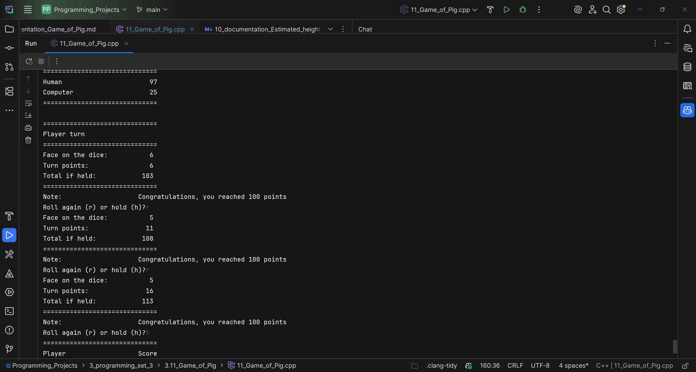

# Practical C++ Problems — Documentation Index

This repository contains practical, real-life programming problems solved in C++.
This README lists the documentation files for the `1_programming_set_1`, `1_programming_set_2`,
`1_programming_set_3` collections (much more to come :-).

## Projects in `1_programming_set_1`

1. 01_Volume — Convert milliliters to gallons and compute number of packets needed.  
   Documentation: `1_programming_set_1/01_Volume/documentation_1_volume.txt`

2. 02_Diet — Estimate maximum safe diet soda consumption based on sweetener toxicity scaling.  
   Documentation: `1_programming_set_1/02_Diet/documentation_2_diet.txt`

3. 03_Sales_Profit_Increase — Calculate sales and profit increases given previous year's figures.  
   Documentation: `1_programming_set_1/03_Sales_Profit_Increase/documentation_3_sales_profit_increase.txt`

4. 04_Loan — Compute face value and monthly payment for a discount installment loan.  
   Documentation: `1_programming_set_1/04_Loan/documentation_4_loan`

5. 05_Truck_capacity — Determine if a truck is overloaded and how many boxes to add/remove.  
   Documentation: `1_programming_set_1/05_Truck_capacity/documentation_5_truck_capacity.txt`

6. 06_cab_fare — Compute cab fare based on distance brackets and time charge.  
   Documentation: `1_programming_set_1/06_cab_fare/documentation_6_cab_fare.txt`

7. 07_calories_deficit — Calculate calories burned during a staged treadmill workout.  
   Documentation: `1_programming_set_1/07_calories_deficit/7_documentation_calories_deficit.txt`

8. 08_Babylonian_algorithm — Babylonian method to approximate square roots (5 iterations).  
   Documentation: `1_programming_set_1/08_Babylonian_algorithm/8_documentation_babylonian_algorithm.txt`

9. 09_arcade_prize — Redeem coupons for candy bars and gumballs with preference logic.  
   Documentation: `1_programming_set_1/09_arcade_prize/9_documentation_arcade_prize.txt`

10. 10_Plance_distance — Compute airplane distance and convert speed to meters per second.  
    Documentation: `1_programming_set_1/10_Plance_distance/10_documentation_plane_distance.txt`

11. 11_Time — Convert total seconds into hours, minutes, and seconds.  
    Documentation: `1_programming_set_1/11_Time/11_documentation_time`

12. 12_BMI — Estimate ideal body weight based on height (5 feet baseline + 5 lb per inch).  
    Documentation: `1_programming_set_1/12_BMI/12_documentation_BMI.txt`

13. 13_Coffee_intake — Compute how many drinks reach a lethal caffeine dose estimate.  
    Documentation: `1_programming_set_1/13_Coffee_intake/13_documentation_Coffee_intake`

---

## Projects in `2_programming_set_2`

1. 2.01_Apartment_price — Estimate apartment prices per floor including compound base price increases, amenities, and taxes.  
   Documentation: `2_programming_set_2/2.01_Apartment_price/1_documentation_Apartment_price.txt`

2. 2.02_Interests_deposit — Calculate how many months a deposit lasts with monthly withdrawals and interest; includes boundary checks.  
   Documentation: `2_programming_set_2/2.02_Interests_deposit/2_documentation_Interests_deposit.txt`

3. 2.03_Financing_education — Determine how many children a donor can sponsor and remaining amount.  
   Documentation: `2_programming_set_2/2.03_Financing_education/3_documentation_Financing_education.txt`

4. 2.04_Prime_numbers — Print all prime numbers between 3 and 100 using an efficient divisor check.  
   Documentation: `2_programming_set_2/2.04_Prime_numbers/4_documentation_Prime_numbers.txt`

5. 2.05_Cryptarithmetic_puzzle — Solve `TOO + TOO + TOO + TOO = GOOD` by brute-force digit assignment with uniqueness checks.  
   Documentation: `2_programming_set_2/2.05_Cryptarithmetic_puzzle/5_documentation_Cryptarithmetic_puzzle.txt`

6. 2.06_Buoyancy — Determine if a sphere floats or sinks in water using Archimedes' principle and sphere volume formula.  
   Documentation: `2_programming_set_2/2.06_Buoyancy/6_documentation_Buoyancy.txt`

7. 2.07_GPA — Compute grade point average from letter grades with validation and case-insensitive input handling.  
   Documentation: `2_programming_set_2/2.07_GPA/7_documentation_GPA.txt`

8. 2.08_Equivalent_Temperatures — Find the integer temperature that is the same in Celsius and Fahrenheit.  
   Documentation: `2_programming_set_2/2.08_Equivalent_Temperatures/8_documentation_Equivalent_temperatures.txt`

9. 2.09_Babylonian_cyclic — Babylonian algorithm to compute square root iteratively until within 1% of previous guess.  
   Documentation: `2_programming_set_2/2.09_Babylonian_cyclic/9_documentation_Babylonian_cyclic.txt`

10. 2.10_Text_replacement — Read a text file and replace occurrences of `hate` with `love` while printing words.  
    Documentation: `2_programming_set_2/2.10_Text_replacement/10_documentation_Text_replacement.txt`

11. 2.11_Ideal_BMI — Read names and heights from a file and compute ideal body weight for each entry.  
    Documentation: `2_programming_set_2/2.11_Ideal_BMI/11_documentation_Ideal_BMI.txt`

12. 2.12_Benfords_Law — Analyze leading-digit distribution of numbers from a file to test Benford's Law.  
    Documentation: `2_programming_set_2/2.12_Benfords_Law/12_documentation_Benfords_Law`

13. 2.13_Pair_sum — Check whether any pair from a file of 10 integers sums to a user-provided target.  
    Documentation: `2_programming_set_2/2.13_Pair_sum/13_documentation_Pair_sum.txt`

---

## Projects in `3_programming_set_3`

1. 3.01_File_size — Compute video file size from bit rate and duration (megabyte = 8000 kilobits).
   Documentation: `3_programming_set_3/3.01_File_size/1_documentation_File_size.txt`

2. 3.02_Salary_hike — Compute employee raise percentage and allow repeated calculations.
   Documentation: `3_programming_set_3/3.02_Salary_hike/2_documentation_Salary_hike.txt`

3. 3.03_Future_salary_hike — Estimate future salaries and total future salary over N years.
   Documentation: `3_programming_set_3/3.03_Future_salary_hike/3_documentation_Future_salary_hike.txt`

4. 3.04_Gravitational_force — Compute gravitational force using global constant G.
   Documentation: `3_programming_set_3/3.04_Gravitational_force/4_documentation_Gravitational_force.txt`

5. 3.05_Clothing_size — Compute hat, jacket, and waist sizes with age adjustments.
   Documentation: `3_programming_set_3/3.05_Clothing_size/5_documentation_Clothing_size.txt`

6. 3.06_Scores_statistics — Compute average and standard deviation of four scores.
   Documentation: `3_programming_set_3/3.06_Scores_statistics/6_documentation_Scores_Statistics.txt`

7. 3.07_Euclidean_distance — Compute distance between two points using the Euclidean formula.
   Documentation: `3_programming_set_3/3.07_Euclidean_distance/7_documentation_Euclidean_distance.txt`

8. 3.08_Bottles_beer — Print the "Ninety-Nine Bottles of Beer" song using words for numbers.
   Documentation: `3_programming_set_3/3.08_Bottles_beer/8_documentation_Bottles_bear.txt`

9. 3.09_Game_of_craps — Simulate 10,000 games of craps (Pass Line) and compute the winning probability.  
   Documentation: `3_programming_set_3/3.09_Game_of_craps/9_documentation_Game_of_craps.md`

10. 3.10_Estimated_height — Estimate the height of a child based on parents' heights and gender
    Documentation: `3_programming_set_3/3.10_Estimated_height/10_documentation_Estimated_height.md`

11. 3.11_Game_of_Pig — Two-player Pig game (human vs computer) based on turn-based die rolls.
    Documentation: `3_programming_set_3/3.11_Game_of_Pig/11_documentation_Game_of_Pig.md`  
    Image: 

